
**Fernerkundung in der Landschaftsplanung - Tag 4 - Visualisierungen und Spektren in SNAP**

**Autoren:** Dieses Tutorial wurde von Fabian Fassnacht entwickelt.

##  Teil 1 - Visualisierungseinstellungen in SNAP

### Lernziele
In diesem Teil des Tutorial lernen Sie wie Sie in SNAP die Visualisierungseinstellungen für die Darstellung von Satellitenbildern verändern können.

### Verwendete Daten
Für dieses Tutorial werden wir ein Subset einer Sentinel-2 Szene sowie ein Subset einer Landsat-Szene jeweils von Wien verwenden.

Sie können die beiden Dateien hier oder in BOKU learn herunterladen:

https://drive.google.com/file/d/12qllPsLwvfuCvMpHMvM77j4aMYqkybCR/view?usp=sharing

### Die Visualisierungseinstellungen in SNAP

Als ersten Schritt laden wir die Sentinel-2 Szene nach SNAP. Dafür gibt es verschiedene Möglichkeiten. Die einfachste ist der Weg über

**File ⇒ Open Product**

(siehe Abbildung 1, markiert mit 1). 

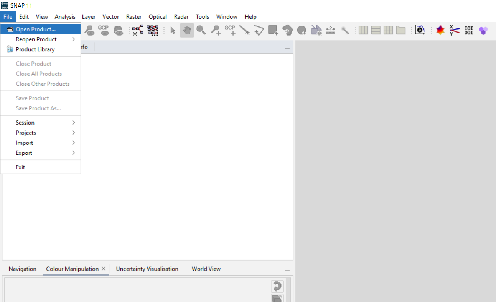

**Abbildung 1: Laden des Sentinel-2 Satellitenbildes**

Dann navigieren wir zum Ordner in dem die Sentinel-2 Daten gespeichert sind und wählen die Datei 

**"subset_0_of_S2A_MSIL1C_20260314T095051_N0512_R079_T33UWP_20260314T132917.dim"**

und bestätigen mit **"open"**.

Wir öffnen nur die Ordnerstrukturen des geladenen Bildes (wie bereits in früheren Tutorials), und lassen uns alle Bänder des Bildes im Produkt Explorer anzeigen. Wir öffnen die Visualisierung für ein einzelnes Band, konkret Band 5, indem wir es doppelklicken (markiert mit 1 in Abbildung 2).

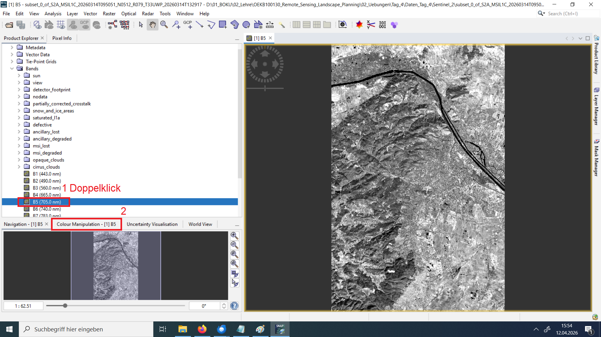

**Abbildung 2: Laden von Band 5 des Sentinel-2 Satellitenbildes**

Danach wählen wir das Menüfeld **"Colour manipulation"** aus, um die Visualisierungseinstellungen aufzurufen (markiert mit 2 in Abbildung 2). 

In diesem tab finden sich diverse Einstellungen, um die Visualisierung der Rasterdaten anzupassen. Es ist hier von zentraler Bedeutung zu verstehen, dass die eigentlichen Daten des geladenen Bildes (Pixelwerte) bei Veränderung der Visualisierungs-Einstellungen nicht verändert werden (außer wenn eine Normalisierung angewandt wird - dies ist aber bei Satellitenbildern selten zu empfehlen) sondern nur die Art und Weise wie die Daten in einen visuellen Eindruck am Monitor übersetzt werden.

Wir schauen uns nun erst einmal die verfügbaren Visualisierungsoptionen in den Basiseinstellungen (markiert mit 1 in Abbildung 3) an.

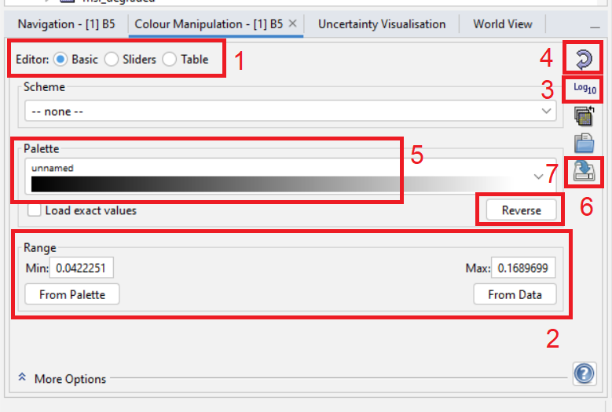

**Abbildung 3: Visualisierungseinstellungen in SNAP**

Wir beginnen mit zwei Optionen, die sehr leicht anzuwenden sind. Die erste ist die Übersetzung der Pixelwerte in eine logaritmische Skala. Wenn wir den dafür vorgesehenen **log10-Button** (markiert mit 3 in Abbildung 3) drücken, sehen wir, dass sich der visuelle Eindruck des dargestellten Bildes verändert. Es erscheint insgesamt heller. In diesem konkreten Fall ist diese Visualisierung keine große Verbesserung und wir können die Standarteinstellungen wieder herstellen in dem wir auf den **Reset-Button** drücken (markiert mit 4 in Abbildung 3). Der log10-Button ist vor allem für die Darstellung von Radar-Daten hilfreich, da bei Radar-Daten die Messwerte häufig nicht linear skaliert sind.

Als nächsten Schritt, werden wir die Spannweite der visualisierten Pixelwerte (**Range** - markiert mit 2 in Abbildung 3) verändern. Hierfür können wir z.B. den Max-Wert **von 0.16xxx auf 0.26** verändern. Dies hat zur Folge, dass das Bild insgesamt dunkler erscheint. Durch die Vergrößerung der Range auf einen Bereich in dem sogut wie keine Pixel mehr entsprechende Werte aufweisen (es gibt kaum Pixel mit einem Pixelwert größer 0.16, deswegen wurden die Standartsettings von SNAP so gewählt) werden die existierenden "hellen" Pixel (die Pixel mit den höchsten Werten im Bild) nun mit einer etwas dunkleren Grauton dargestellt, wohingegen die sehr hellen Grautöne (nahe weiss) gar nicht mehr vorkommen, da diese Werte nun für Pixel mit Werten nahe 0.26 reserviert sind, die faktisch sogut wie nicht vorkommen im Bild (mehr Infos dazu kommen gleich noch).

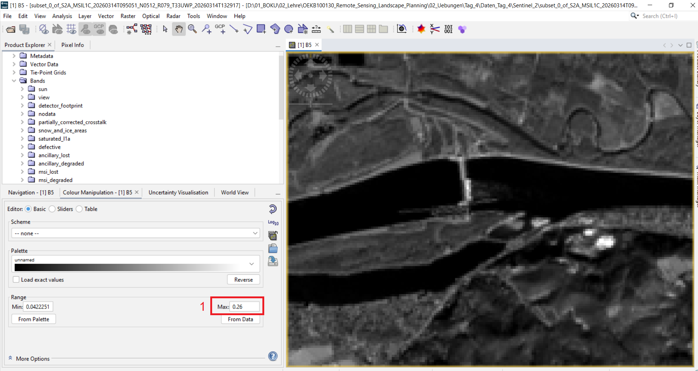

**Abbildung 4:  Visualisierung eines Donauauschnittes mit einer normalen Visualisierungseinstellung**

Diese Einstellung kann in manchen Fällen tatsächlich sehr relevant sein. Ein Beispiel hierfür sind Gewässer. Wie wir bereits in der Vorlesung gehört haben erscheinen Gewässer in Satellitenbildern sehr dunkel im Vergleich zu anderen Landbedeckungsklassen, da Wasser nur sehr wenig elektromagnetische Strahlung reflektiert. In unserem Satellitenbild erscheint z.B. die Donau in den aktuellen Visualsierungseinstellungen (Range zwischen 0.046xx und 0.26) homogen sehr dunkel (in Abbildung 4 wurde an einen Ausschnitt der Donau herangezoomt). Wenn wir nun die Visualisierungeinstellungen auf sehr kleine Pixelwerte einschränken, in meinem Fall zwischen Werte von **0.03 und 0.05** so ändert sich dieser Eindruck stark. Plötzlich ist die Donau nicht mehr homogen schwarz sondern es werden Muster und Gradienten sichtbar. Was ebenfalls auffällt ist, dass fast alle umgebenden Gebiete, die nicht Wasser repräsentieren, nun in weiss dargestellt sind. Dies ist plausibel, da ihre Pixelwerte höher als der gewählte Maximalwert von 0.05 liegen. 

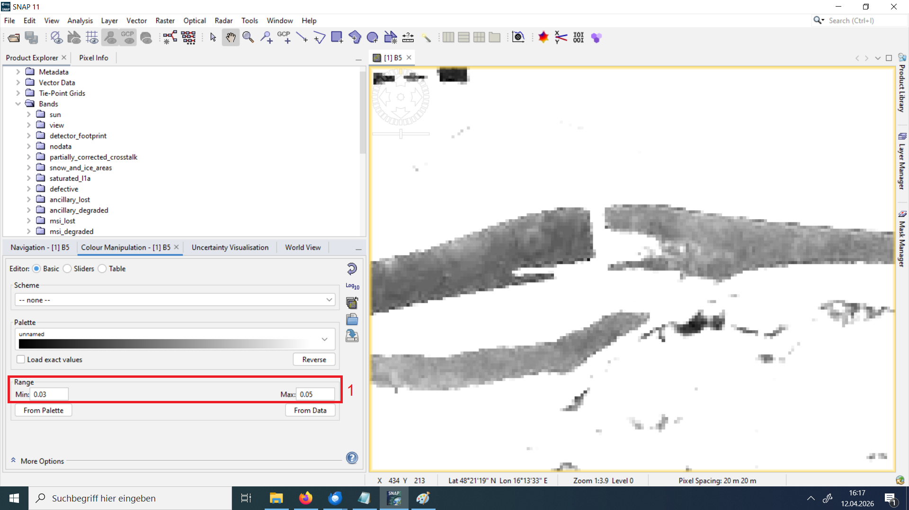

**Abbildung 5: Visualisierung eines Donauauschnittes mit einer Visualisierungseinstellung, die auf die niedrigen Reflektanzen von Wasser angepasst sind**

Angenommen wir würden uns in unserer Forschung oder unserer Arbeit vor allem für Wasser interessieren und wir wären mit den gefundenen Einstellungen nun sehr zufrieden, so könnten wir die aktuellen Range-Werte als sogenannte "(Farb-)Palette" abspeichern. Dafür müssen wir den Button markiert mit 7 in Abbildung 3 klicken. In meinem Fall, habe ich dies getan und das File als "water_fabi.cpd" gespeichert. Diese Datei ist nichts anderes als ein Text-File welches die aktuellen Range-Werte (markiert mit 1 in Abbildung 6) und noch ein paar weitere Informationen enthält (siehe Abbildung 6).

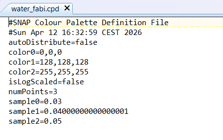

**Abbildung 6: Inhalte des Paletten-Files in SNAP**

Als letzte Einstellung für Basiseinstellungen drücken wir nun den **Inversion**-Button, welcher die Zuordnung der Pixelwerte zu den Grauwerten invertiert. Konkret werden standardmäßig hohe Pixelwerte mit hellen Farben (nahe weiss) dargestellt und niedrige Pixelwerte mit dunklen Farben (nahe schwarz) dargestellt. Durch die Invertierung wird dies umgekehrt.

In unserem Fall bedeutet dies, dass nun alle Bereiche, die nicht Wasser sind in schwarz erscheinen (Abbildung 7).

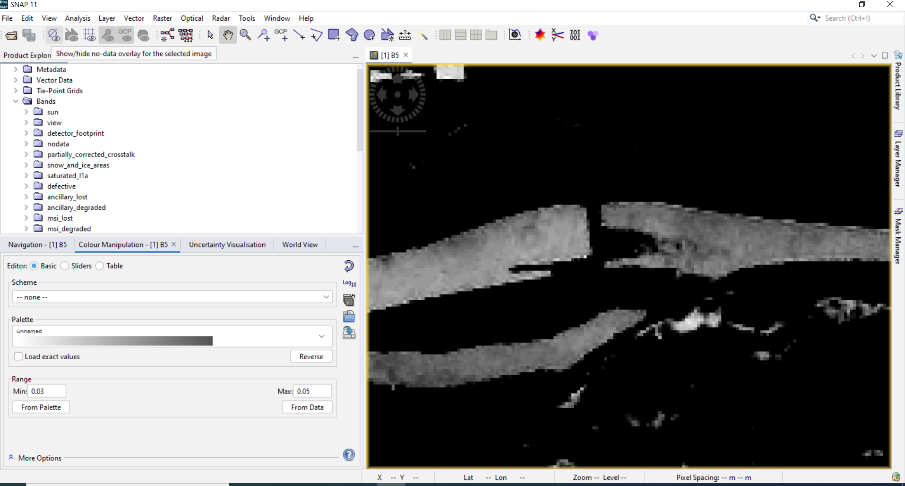

**Abbildung 7: Visualisierungseindruck nach Anwendung der Invertierung]**

Wir setzen nun die Visualisierungseinstellungen wieder zurück indem wir den **Reset**-Button drücken und wir zoomen auch wieder heraus, um das gesamte Satellitenbild zu sehen. Dann wählen wir im Visualisierungsmenü den Reiter **"Sliders"** welcher uns zum Menü führt, welches in Abbildung 8 dargestellt ist.

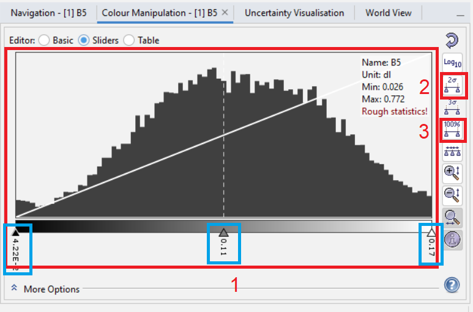

**Abbildung 8: Das "Sliders"-Menü**

Die zentrale Darstellung in diesem Menü ist das Histogramm (markiert mit 1 in Abbildung 8). Das Histogram zeigt die Häufigkeit (y-Achse) der verschiedenen Pixelwertbereiche (x-Achse) des aktuell dargestellten Bandes dar. Das Histogram wird dabei basierend auf einer repräsentativen Stichprobe aller Pixel des Bildes geschätzt. Unter dem Histogram ist der Farbverlauf dargestellt, der zur Visualisierung des Bildes führt. Die "Slider" (markiert mit blauen Boxen in Abbildung 8) zeigen jeweils die Farben an, die für die jeweilige Pixelwerten verwendet werden. Pixelwerte, die dazwischen liegen werden in diesem Fall dementsprechend linear skaliert.

Wir sehen, dass in unserem geladenen Band 5 die Pixelwerte eine mehr oder weniger normale Verteilung zeigen mit relativ wenigen sehr niedrigen und sehr hohen Werten und einer großen Anzahl an mittleren Pixelwerten. Gleichzeitig sehen wir aber auch, dass es sowohl auf der linken als auch der rechten Grenze des Histogramm so aussieht, als ob die Wertebereiche abgeschnitten wurden. Dies ist tatsächlich auch der Fall und dieses Vorgehen, dass die extremen Enden der Verteilung ("Ausreißer") in der Visualisierung nicht berücksichtigt werden, ist relativ gängig.

Unter der Slider-Ansicht, gibt es auch mehrere Buttons, die es ermöglichen die Art und Weise, wie die Werteverteilung begrenzt wird, automatisch festzulegen. Konkret gibt es zwei Buttons, die die Ober und die Untergrenze der Ramge als plus und minus 2 bzw. 3 Standartabweichungen vom Mittelwert (der Stichprobe von Pixelwerten, die benutzt wurden, um das Histogramm zu berechnen) definieren (Button markiert mit 2 in Abbildung 8 und der Button darunter). Dazu gibt es einen weiteren Button, der die volle Range verwendet (d.h., keine Beschneidung der Begrenzung, sondern festlegen der oberen und unteren Grenze basierend auf den minimalen und maximalen Pixelwerten) (markiert mit 3 in Abbilldung 8). Klicken Sie gerne auf die Buttons und schauen Sie sich an, wie sich das Histogram verändert. Über den **Reset** Button, können sie die ursprüngliche Darstellung immer wiederherstellen.

Die Darstellung des Histogramm ändert sich auch, wenn wir auf das **"Basic"** Menü zurückwechseln und die Range dort manuell ändern. In Abbildung 9 wird dargestellt, wie das Histogramm aussieht, wenn man den Max-Wert im Basic Menü auf 0.27 ändert.

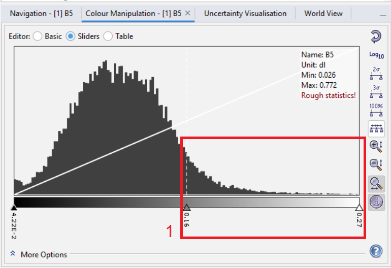

**Abbildung 9: Das "Sliders"-Menü nach Anpassung des Maximalwertes im Basic-Menü**

Schließlich ist noch erwähnenswert, dass es möglich ist über einen Rechtsklick auf den Farbgradienten und der anschließend Auswahl "Add new Slider" (siehe Abbildung 10) zusätzliche Slider zu erstellen und damit auch Skalierungen mit unterschiedlichen "Steigungen" zu ermöglichen. D.h., man könnte z.B. die niedrigen Pixelwere stärker in der Visualisierung differenzieren (in dem in Abbildung 9 der mittlere Slider nach links geschoben wird) als die hohen Pixelwerte (falls das für meinen jeweiligen Anwendungsfall interessant wäre). Über das Hinzufügen von weiteren Slidern, kann die Visualisierung immer weiter differenziert werden.

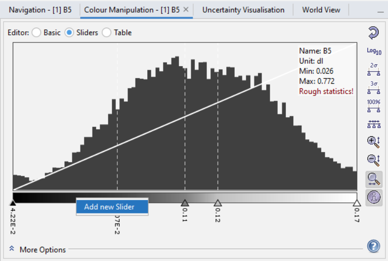

**Abbildung 10: Das "Sliders"-Menü nach dem Hinzufügen weiterer Slider**

Abschließend wird hier noch darauf hingewiesen, dass bei einer Echtfarbendarstellung bzw. eine Falschfarbendarstellung mit drei Kanälen, die Visualisierungseinstellungen prinzipiell identisch sind, dann aber für alle drei Farbkanäle der Visualisierung (rot, grün. blau) durchgeführt werden müssen (siehe Abbildung 11). Sie können dies gerne einmal ausprobieren. Bei der RGB-Darstellung führt z.B. die Verwendung der 2 Standartabweichungsoption bei allen drei Kanälen zu einer verbesserten farblichen Darstellung des Satellitenbildes.

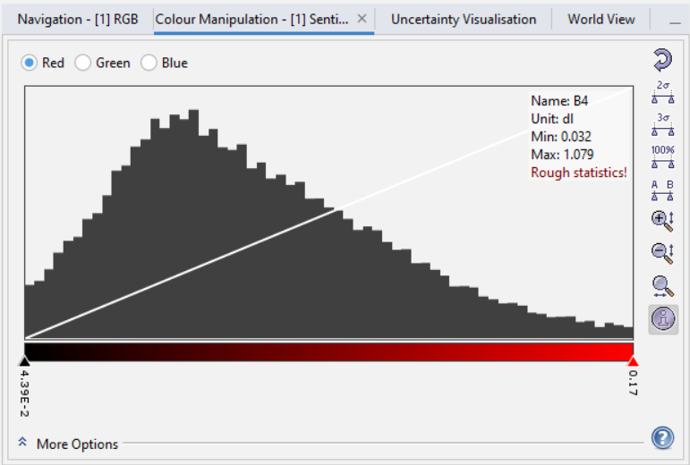

**Abbildung 11: Visualisierungseinstellungen für eine RGB-Darstellung**

## Teil 2 - Anzeigen von Spektren in SNAP

### Lernziele
In diesem Teil des Tutorial lernen Sie wie Sie in SNAP Spektren einzelner Pixel sowie mehrerer Pins visualisieren können. Zusätzlich schauen wir uns an, wie Wellenlängenbereiche von spektralen Bändern definiert werden können, wenn diese bei einem Satellitenbild noch nicht in den Metadaten enthalten sind.

### Visualisierung von Spektren

Spektren sind eine essenzielle Darstellungsform von spektralen Messungen. Diese umfassen sowohl im Labor gemessene Daten als auch Daten, die mit passiven, optischen Fernerkundungssensoren erhoben wurden. Ein Spektrum visualisiert die gemessene zurückgestrahlte eletromagnetische Strahlung eines Objekts in verschiedenen Wellenlängenbereichen. D.h., auf der x-Achse befindet sich die Wellenlänge und auf der y-Achse die gemessene Reflektanz (in % der eingefallenen Strahlung). Man spricht in der Regel erst dann von einem Spektrum, wenn Messungen in mehr als einer Wellenlänge durchgeführt wurden. Aber auch wenn z.B. nur Spektralinformationen in drei Kanälen/Bändern vorliegen wie auch bei einer handelsüblichen Foto-Kamera, kann man theoretisch bereits von einem Spektrum sprechen.

In SNAP, ist eine Voraussetzung für die Darstellung von Spektren, dass die Wellenlängenbereiche der Bänder in den Metadaten des Datensatzes definiert sind. In diesem Tutorial ist dies für die Sentinel-2 Daten der Fall, für die Landsat-Daten nicht. Im Folgenden, werden wir zuerst lernen wie wir uns für die Sentinel-2 Daten Spektren anzeigen lassen können, und danach was wir tun müssen, um dies auch für die Landsat-Daten zu ermöglichen.

Wenn die Wellenlängen der Bänder bereits definiert sind, ist die Darstellung von Spektren in SNAP relativ einfach möglich. Hierfür öffnen wir (falls nicht bereits geschehen) zuerst das Sentinel-2 Satellitenbild und erstellen dann eine RGB-Visualisierung via 

**rechtsklick auf das Produkt ⇒ Open RGB Image Window**

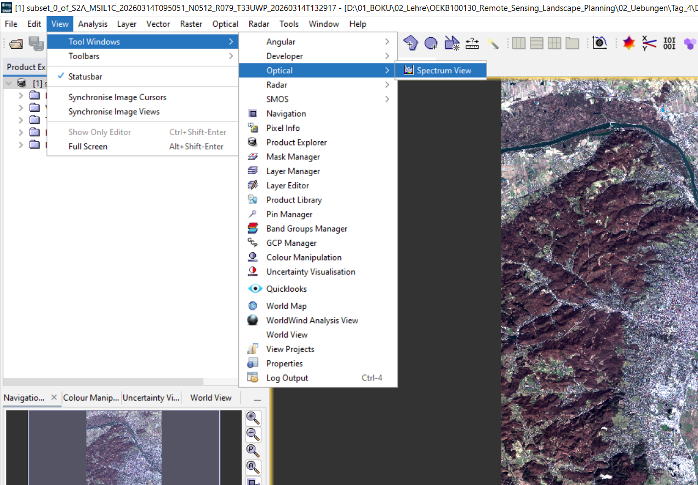

**Abbildung 12: Aufrufen des Spektrum Views**

Dann wählen wir - wie in Abbildung 12 dargestellt - im Hauptmenü

**View ⇒ Tools ⇒ Optical ⇒ Spectrum View**

Daraufhin öffnet sich ein neues Fenster mit einem Hinweis, der darüber informiert, dass durch das drücken und halten der "Shift"-Taste die y-Achse der Visualisierung des Spektrums automatisch auf das aktuell dargestellte Spektrum optimiert wird (Abbildung 13). Dies kann im Folgenden gerne ausprobiert werden.

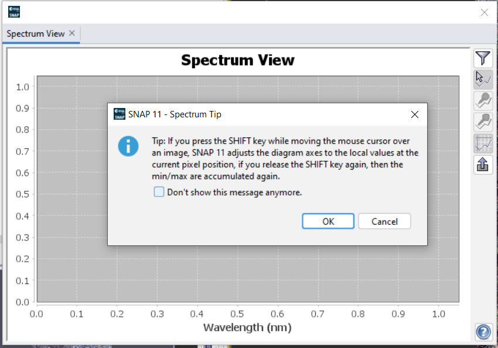

**Abbildung 13: Das Spektrum-View Tool mit Warnhinweis**

Wenn wir den Hinweis bestätigt haben, geht das Fenster automatisch in den Modus über in dem immer für den Pixel, der gerade vom Maus-Cursor bedeckt wird, das entsprechende Spektrum angezeigt wird (Abbildung 14).

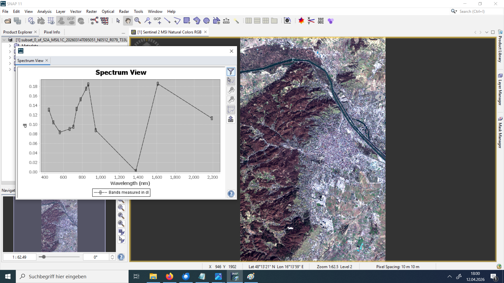

**Abbildung 14: Das Spektrum-View Too**

Sie können nun gerne den Mauscursor auf verschiedene Landbedeckungsklassen bewegen und dabei zusehen wie sich das Spektrum verändert. Nutzen Sie die Zoom-Funktion bzw. das Mausrad, um die Positionen im Satellitenbild genauer auswählen zu können. Im aktuellen Modus wird nun immer nur ein einzelnes Spektrum angezeigt, welches sich sofort verändert, wenn der Mauscursor bewegt wird.

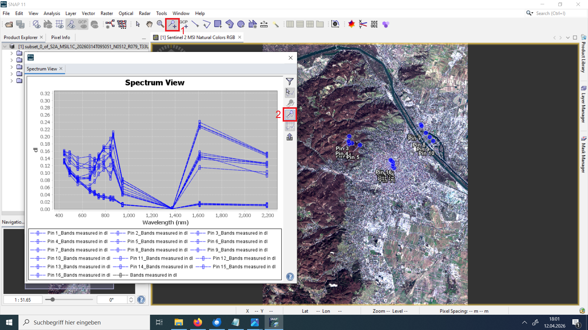

**Abbildung 15: Spektren für mehrere Pins, die drei Landbedeckungsklassen abdecke**

Um kontrolliertere Analysen zu ermöglichen, kann man z.B. das Pin placing tool verwenden (markiert mit 1 in Abbildung 15). Schließen Sie das Spectrum View Fenster und aktivieren Sie das **pin placing tool**. Setzen Sie nun mehrere pins in drei verschiedenen Landbedeckungsklassen (in meinem Fall sind es Wasser, Vegetation, und versiegelte Flächen). 

Starten Sie dann erneut das Spectrum View-Tool und klicken Sie den **"Show spectra for all pins"** button (markiert mit 2 in Abbildung 15). Sie sollten nun eine ähnliche Darstellung sehen wie in Abbildung 15.

Diese Darstellung ist bereits recht interessant, allerdings ist es nun noch etwas unbefriedigend, dass alle Spektren in derselben Farbe dargestellt werden und man daher die Landbedeckungsklassen nicht direkt unterscheiden kann. Um eine solche Darstellung zu ermöglichen öffnen wir den **"Pin Manager"** über

**View ⇒ Tool Windows ⇒ Pin manager**

(siehe Abbildung 16). 

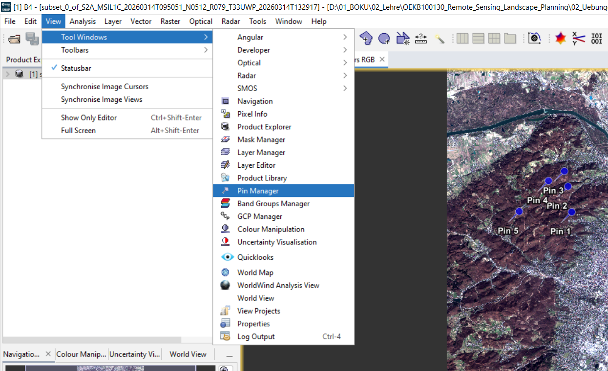

**Abbildung 16: Aufrufen des Pin-Managers**

Hier können nun die Farben der Pins angepasst werden (Abbildung 17).

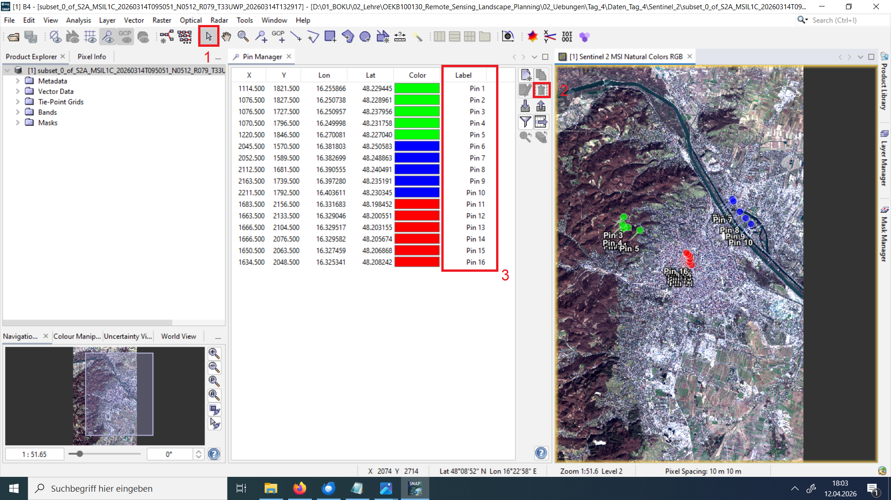

**Abbildung 17: Der Pin-Manager**

Es kann sich gegebenenfalls auch lohnen den Prozess nochmal von vorne zu beginnen in dem man zuerst nochmal alle Pins löscht - dafür wählt man entweder Option 1: den Mauscursor (markiert mit 1 in Abbildung 17) klickt auf einzelne Pins bzw. markiert mehrere Pins mit dem aufspannen eines Selektionsrechtecks und löscht diese dann mit dem "entf"-Button auf dem Keyboard des Computers/Laptops oder Option 2: Man wählt alle Einträge im Pin-Manager aus und klickt dann den Mülleimer-Button (markiert mit 2 in Abbildung 17). Danach kann man dann die Pins neu setzen und z.B. jeweils erst alle Pins für eine Landbedeckungsklasse setzen, dann deren Farbe verändern und dann mit der zweiten Landbedeckungsklasse weitermachen.

Falls gewünscht, kann man die Labels der Pins auch noch anpassen in dem man die entsprechenden Labels selektiert und überschreibt (markiert mit 3 in Abbildung 17). Wenn die Pins der jeweiligen Landbedeckungsklassen nun jeweils eine eigene Farbe haben und man das **Spectrum View**-Tool wieder öffnet, sollte sich ein Eindruck ergeben wie in Abbildung 18 dargestellt.

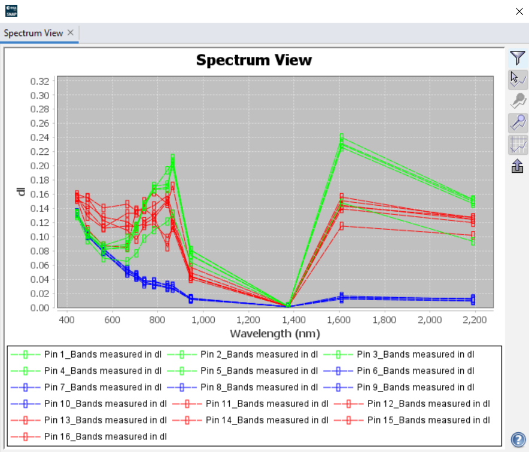

**Abbildung 18: Das Spectrum-View Tool mit Pins in unterschiedlichen Farben**

### Ergänzung von Wellenlängeninformationen

Als nächsten Schritt, wollen wir uns nun auch Spektren für das Landsat-Satellitenbild anzeigen lassen. Dafür laden wir das Landsat-Bild so wie wir bereits das Sentinel-2 Bild geladen hatten, nur dass wir dieses Mal in den Ordner navigieren wo das Landsat-Bild liegt und wir selektieren die Datei:

**"ls_wien_clipped.tif"**

und bestätigen mit **"open"**.

In der Regel informiert SNAP beim Laden des Landsat-Bildes darüber, dass es mehrere Möglichkeiten gibt dieses Satellitenbild im GeoTiff-Format zu laden. In diesem Fall ist es egal welche Option verwendet wird und wir bestätigen einfach mit **"OK"**.

Danach öffnen wir einen RGB-View von Landsat über den bekannten Weg:

**Rechtsklick auf das Produkt ⇒ Open RGB Image Window**

ACHTUNG: Da bei unserem Landsat-Bild die Wellenlängen der Bänder nicht in den Meta-Daten definiert sind, weiss SNAP nicht automatisch welches Band welcher Farbe entspricht. D.h., SNAP weist die Bänder zuerst einmal falsch zu (Rot zu Blau, Grün zu Grün und Blau zu Rot). Um dies zu verhindern können wir die Zuordnung manuell anpassen wie in Abbildung 19 gezeigt.

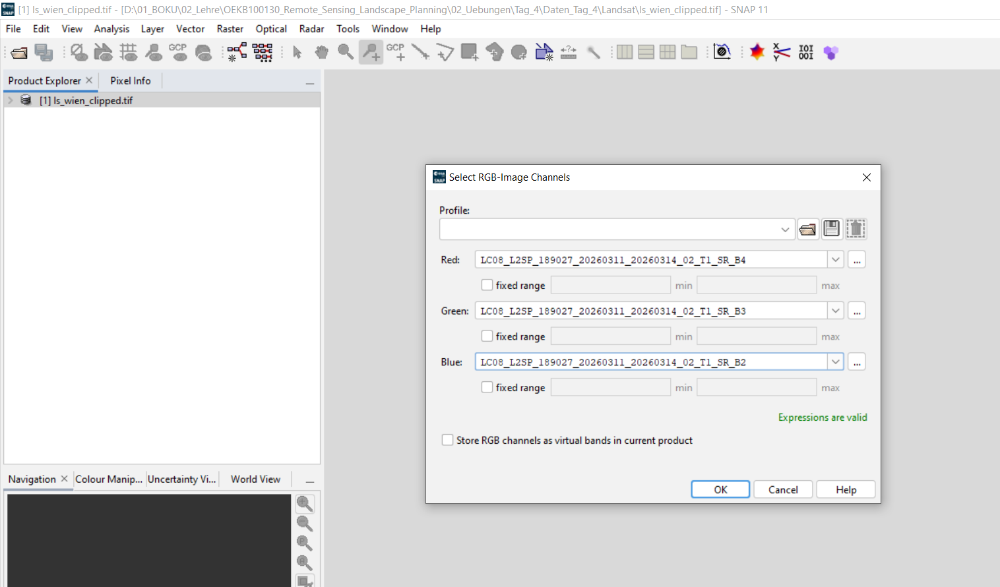

**Abbildung 19: Das Spectrum-View Tool mit Pins in unterschiedlichen Farben**

Um diese Zuordnung so vorzunehmen, müssen wir wissen, welche Landsat-Bänder welchen Wellenlängenbereichen entsprechen und wir müssen auch wissen, welche Bänder in unserer konkreten Datei enthalten sind. Wer sich nicht daran erinnert: Bitte im Landsat-Tutorial vom letzten Termin nachschauen bzw. Abbildung 20 gibt auch nochmal eine Hilfestellunge, da wir diese Zahlen jetzt auch gleich benötigen werden. Eine weitere Hilfestellung: In unserem Datensatz sind die Landsat-Bänder 2-7 enthalten (gespeichert als Band 1-6 in der Tif-Datei, wobei die ursprünglichen Namensbezeichnungen erhalten blieben).

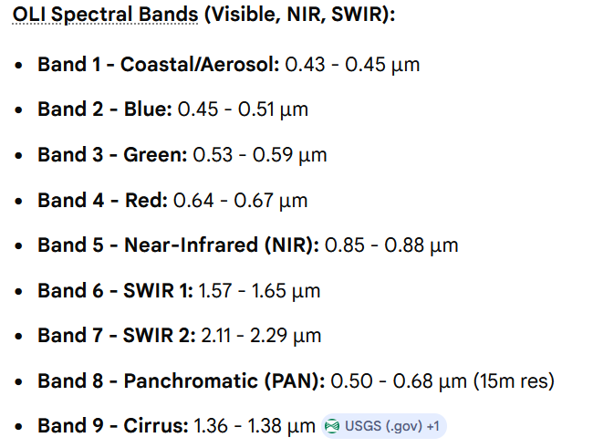

**Abbildung 20: Landsat 8 - Wellenlängenbereiche der Bänder**

Nun zum Problem: Wenn wir nun das Landsat-Produkt selektieren (bzw. am Besten auch nur das Landsat-Produkt überhaupt geladen haben) und wiederum das **Spectrum-View**-Tool aufrufen, so wird dieses zwar angezeigt, aber es werden keine Spektren angezeigt. Anstatt dessen wird nur ein Hinweis
 
"Collecting spectral information"

dargestellt (Abbildung 21).

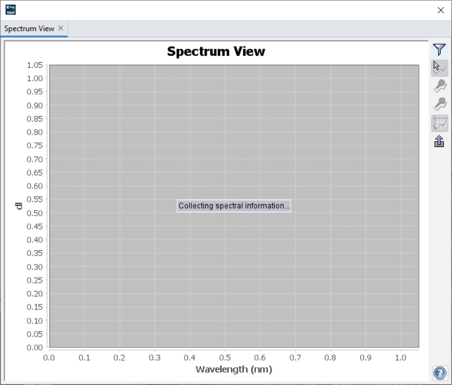

**Abbildung 21: Das Spectrum-View Tool mit Landsat-Daten**

Um das Anzeigen von Spektren auch für das Landsat Bild zu ermöglichen, müssen für jedes der Bänder des Bildes eine zentrale Wellenlänge sowie die Bandweite definiert werden. Hierfür müssen die Eigenschaften jeden Bandes aufgerufen werden (siehe Abbildung 22). Das geht über

**rechtsklick auf das Band ==> "Properties"**

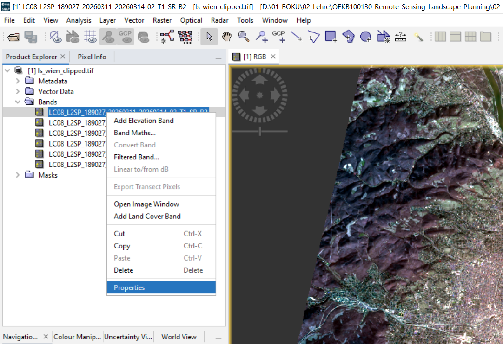

**Abbildung 22: Aufrufen der Bandeigenschaften**

Im nun erscheinenden Fenster kann man sowohl die zentrale Wellenlänge (markiert mit 1 in Abbildung 23) als auch die Bandweite eingeben (markiert mit 2 in Abbildung 23).

**Abbildung 22: Eintragung der Wellenlänge und Bandweite**

Hierbei muss darauf geachtet werden, dass die Werte in Nanometer eingegeben werden müssen. In Abbildung 20 sehen wir, dass das Landsat Band 2 den Wellenlängenbereich zwischen 0.45-0.51 Mikrometer abdeckt. Dies entspricht dem Bereich 450 - 510 Nanometer. Die zentrale Wellenlänge wäre demnach bei 480 Nanometer und die Bandbreite wäre: 510 minus 450 = 60 Nanometer. Diese Werte sollten nun in dieser Form für alle 6 Bänder berechnet und eingetragen werden.

Danach sollte die "Spectrum-View"-Ansicht auch für das Landsat-Bild funktionieren.

## HAUSAUFGABE

1. Ihnen ist vielleicht bereits aufgefallen, dass bei den Spektren des Sentinel-2 Bildes ein Band (bei 1375 nm) alle Werte von allen Pixeln bei nahe Null zu liegen scheinen. Erstellen Sie eine Visualisierung des Bandes und ergänzen Sie eine kurze Erläuterung warum das Bild so aussieht wie es aussieht (basierend auch auf was Sie in der Vorlesung bereits gelernt haben). 

2. In unserem aktuellen Sentinel-2 Bild sind 13 Spektralkanäle enthalten. Von diesen 13 Kanälen haben 3 Kanäle/Bänder eine deutlich gröbere Auflösung von 60 m, wohingegen die anderen 10 Kanäle/Bänder eine Auflösung von 10 bzw. 20 m haben. Erstellen Sie ein Subset des Sentinel-2 Bildes in SNAP und behalten Sie nur die Kanäle mit 10 bzw. 20 m Auflösung. Sie finden das Subset-Tool in SNAP unter **Raster ⇒ Subset**. (Wer sich nicht mehr erinnert findet hier auch nochmal die Erläuterung von der früheren Übung (ACHTUNG: nur der erste Teil ist relevant, das resampling muss nicht unbedingt gemacht werden): https://github.com/fabianfassnacht/BOKU_Uebung_2_Export_Sentinel_2/blob/main/Tag_2_Export.md)

3. Für dieses neue Bild mit nur 10 Kanälen/Bändern, setzen sie bitte jeweils 10 Pins (wie heute gelernt) für die Landbedeckungsklassen "Wiese/Grasland"; "Wasser"; "Wald" und "urbanes Gebiet/versiegelte Fläche" und erstellen Sie eine Abbildung, die die Spektren der Landbedeckungsklassen in verschiedenen Farben zeigt.

4. Wiederholen Sie die Aufgabe 3. mit dem Landsat-Bild. Was fällt Ihnen auf, wenn Sie die Spektren von Landsat und Sentinel-2 vergleichen? 
